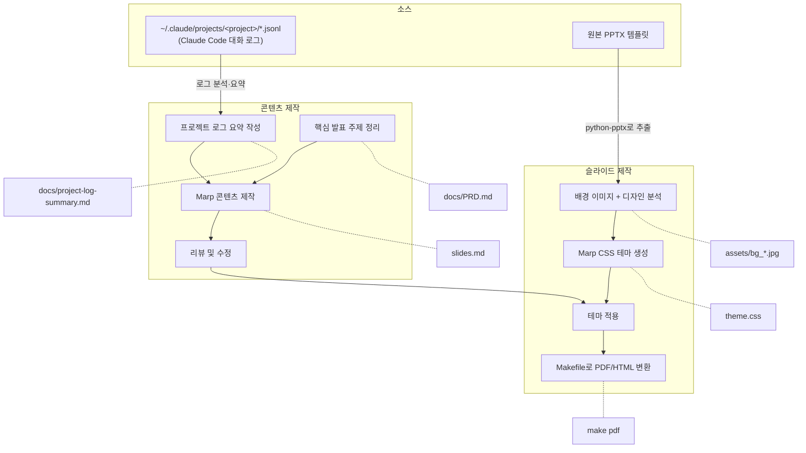

# Slides — 바이브 코딩으로 완성하는 AWS 서버리스 OpenClaw

AWS Unicorn Day 2026 발표 자료. [Marp](https://marp.app/) 기반 마크다운 프레젠테이션.

## 제작 워크플로우



## 디렉토리 구조

```
slides/
├── assets/          # 이미지, SVG 다이어그램
├── docs/            # 기획 문서 (PRD, 작업 로그)
├── templates/       # 원본 PPTX 템플릿
├── .claude/skills/  # Claude Code 스킬
├── Makefile         # PDF/HTML/PPTX 빌드
├── slides.md        # 발표 자료 (메인)
└── theme.css        # Marp 테마 (PPTX 템플릿에서 추출)
```

## 사용법

### 미리보기 (VSCode)

[Marp for VS Code](https://marketplace.visualstudio.com/items?itemName=marp-team.marp-vscode) 확장 설치 후 `slides.md`를 열면 실시간 미리보기 가능.

프로젝트 루트의 `.vscode/settings.json`에 테마 경로가 설정되어 있음.

### 내보내기

```bash
make pdf       # slides.pdf
make html      # slides.html
make pptx      # slides.pptx
make all       # 전체 포맷
make clean     # 생성 파일 삭제
```

생성 파일은 `.gitignore`에 포함.

## 테마

`theme.css`는 `templates/AWS Unicorn Day 2026_Template.pptx`에서 추출한 배경 이미지와 디자인을 Marp CSS로 변환한 것.

| 슬라이드 클래스 | 용도 | 배경 |
|---------------|------|------|
| `title` | 표지 | `bg_cover.jpg` + 그라데이션 오버레이 |
| `speaker` | 발표자 소개 | `bg_content.jpg` + 그라데이션 오버레이 |
| `lead` | 섹션 구분 | 단색 배경, 중앙 정렬 |
| `closing` | 마지막 | `bg_closing.jpg` + 그라데이션 오버레이 |
| _(기본)_ | 본문 | 단색 배경 (#000) |

테마 생성 과정은 `/marp-theme` 스킬로 문서화되어 있음.

## 슬라이드 작성 규칙

- `<!-- _class: title -->` 등으로 슬라이드별 클래스 지정
- `<div class="columns">` 2단 레이아웃 사용 시 Marp `--html` 플래그 필요
- `<br>` 태그로 수직 간격 조절
- `**강조**` 는 주황색(#FF9900)으로 렌더링
