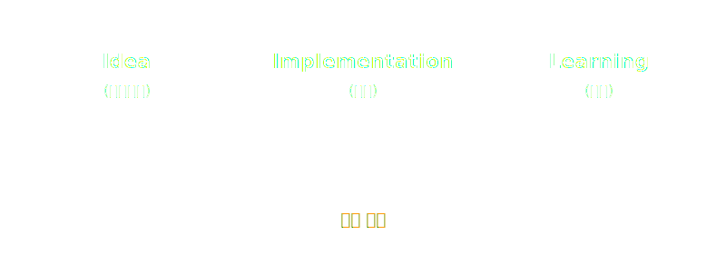
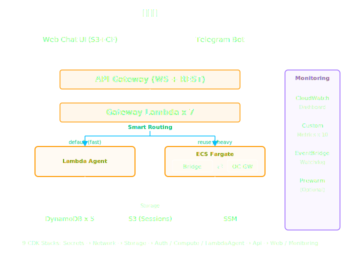

<!-- _class: title -->
<!-- _paginate: false -->
<!-- _footer: "" -->

---

<!-- _class: speaker -->
<!-- _paginate: false -->
<!-- _footer: "" -->

# 바이브 코딩으로 완성하는 AWS 서버리스 OpenClaw
> https://github.com/serithemage/serverless-openclaw
## 아이디어 하나로 프로덕션급 시스템을 3일 만에 구축한 이야기

<div class="speaker-info">

**정도현**
수석 컨설턴트
로보코

</div>

---

# 발표자 소개

<div class="columns">
<div>

### 정도현

- **로보코** 수석 컨설턴트 (2024.12~)
- 95년부터 개발자, 아키텍트, 컨설턴트로 활동
- **AWS** 소프트웨어 개발자 / 테크니컬 트레이너 (2016~2024)
- 핸즈온 바이브코딩 (한빛미디어) 저자

</div>
<div>

### 관심 분야

- **바이브 코딩** & AI 기반 개발 방법론
- 클라우드 마이그레이션 & 마이크로서비스
- DevOps & CI/CD
- AI 도구를 활용한 조직 혁신

</div>
</div>

<br>

> GitHub [@serithemage](https://github.com/serithemage) &nbsp;|&nbsp; Blog [roboco.io](https://roboco.io)

---

# 오늘의 이야기

> 아이디어 하나에서 출발해 **3일 만에**
> 프로덕션급 서버리스 인프라를 구축한 이야기

<br>

| 순서 | 주제 | 시간 |
|:---:|------|:---:|
| 1 | **아이디어에서 구현까지** — 바이브 코딩으로 빠르게 만드는 법 | 7분 |
| 2 | **속도와 안정성** — 다계층 검증이 두 마리 토끼를 잡는 비결 | 7분 |
| 3 | **무엇이 가능해지는가** — 결과와 비즈니스 임팩트 | 6분 |

---

# OpenClaw이란?

### 오픈소스 자율형 AI 에이전트 플랫폼

<div class="columns">
<div>

**단순 챗봇이 아닌 실행형 에이전트**

- **계획 → 실행 → 완료 확인** 워크플로우
- 파일 읽기/쓰기, 브라우저 조작, 터미널 명령 실행
- 하트비트 엔진으로 **능동적 모니터링** (크론, 웹훅)
- **영구 메모리** — 장기 상태 및 작업 히스토리 유지

</div>
<div>

**멀티 채널 & 멀티 LLM**

- Telegram, Discord, Slack, WhatsApp 등 **15개+** 채널
- Claude, GPT, Gemini, DeepSeek 등 **LLM 자유 선택**
- **100개+** AgentSkills (브라우저, 스마트홈, 미디어...)
- **675K** 줄 TypeScript, 로컬 퍼스트 아키텍처

</div>
</div>

<br>

> 단순 보조 도구를 넘어 **디지털 동료(Digital Coworker)** 로 진화하는 AI

---

# 시작은 하나의 아이디어

<div class="columns">
<div>

### 요건

- OpenClaw는 자신의 **PC에서 실행** — 강력하지만 제약 존재
  - PC가 꺼지면 사용 불가 (가용성)
  - 외부 접근 시 보안 위험
  - PC안의 모든 리소스에 접근 가능 (권한 관리 어려움)
- 이동 중에도 사용할 수 있도록 **클라우드에 올려보자!**

</div>
<div>

### 그런데...

- 하루 **1-2시간** 만 사용, 나머지 **22시간은 유휴**
- EC2 상시 운영: 월 **$37** (t3.medium)
- Fargate 상시 운영: 월 **$35** (0.5 vCPU)
- 22시간 유휴 비용을 내고 싶지 않다!

</div>
</div>

<br>

> "강력한 보안을 유지하면서, 최소한의 비용으로 프라이빗 OpenClaw 환경 구축.
> 이 아이디어를 **바이브 코딩** 으로 구현하려면?"

---

# 왜 서버리스인가?

### 유휴 시간에 비용을 내지 않는 아키텍처

<div class="columns">
<div>

**EC2 / 상시 Fargate의 한계**

- 하루 1-2시간 사용, **22시간 유휴**
- 유휴 시간에도 과금 → 월 $35~37
- 스케일 업/다운 직접 관리 필요
- OS 패치, 보안 업데이트 부담

</div>
<div>

**서버리스가 제공하는 것**

- **사용한 만큼만 과금** → 월 $0.27~1.11
- Lambda Agent = **유휴 비용 $0**, 콜드 1.35초
- Smart Routing = Lambda 기본 + Fargate 자동 폴백
- 관리형 서비스 → **운영 부담 최소화**

</div>
</div>

<br>

> 핵심 결정 3가지: **NAT Gateway 제거** (-$33/월), **Fargate Spot** (-70%), **API Gateway** (ALB 대비 -$16/월)

---

<!-- _class: lead -->

# Part 1
# 아이디어에서 구현까지

---

# 바이브 코딩이란?

> "I just see things, say things, run things, and copy-paste things,
> and it mostly works."
> — **Andrej Karpathy** (2025.02)

<br>

### 코드를 직접 쓰지 않고, AI와 대화하며 시스템을 구축하는 개발 방식

<br>

토니 스타크가 쟈비스와 함께 아이언맨 수트를 만드는 것처럼,
개발자가 **AI 코딩 에이전트** 와 함께 복잡한 시스템을 설계하고 구현

- "이 프로젝트를 서버리스로 만들기 위한 PRD를 작성하기 위해 인터뷰를 진행해줘"
- "비용 최적화를 극한까지 하고 싶어. Fargate Spot + API Gateway 조합을 조사해줘"
- "CDK 스택 간 순환 참조를 해결해줘"

---

# 바이브 코딩의 핵심 사이클



| 사이클 | Idea | Implementation | Learning |
|--------|------|----------------|----------|
| **비용** | "월 $1로 운영 가능할까?" | NAT GW 제거, Spot, API GW | Secrets Manager도 $2/월 → SSM 마이그레이션 |
| **콜드 스타트** | "126초는 너무 길다" | 9단계 최적화 (Docker, 병렬화, zstd) | v2026.2.14 호환성 깨짐 → 버전 피닝 |
| **사용성** | "웹과 텔레그램 컨테이너가 따로?" | OTP 기반 Identity Linking | IDOR 방지: unlink는 Web-only |

> 이 사이클을 **빠르게** 돌릴수록, **더 큰 비즈니스 기회** 가 열린다

---

# 3일간의 구축 과정

| Phase | 기간 | 산출물 |
|-------|------|--------|
| **설계** | 2/8  | PRD, 아키텍처, 구현 계획, 비용 분석, 보안 모델 |
| **MVP 구현** | 2/9 | 10단계 구현, 259 UT + 35 E2E, 전체 인프라 |
| **콜드 스타트 개선** | 2/12 | 콜드 스타트 2분→1분 미만, 프리워밍, 모니터링 |

> 여러 프로젝트를 진행하면서 사이드 프로젝트로서 설계 하루, 구현 **대부분 하루** — 바이브 코딩의 압도적 생산성

---

# 완성된 아키텍처

<div class="columns">
<div style="width: 700px;">



</div>
<div>

**9개 CDK 스택**
  - Secrets → Network → Storage → Auth / Compute / LambdaAgent → Api → Web / Monitoring

**Smart Routing**
  - 요청 내용에 따라 Lambda 또는 Fargate로 자동 라우팅

**Unified Session** 
  - S3 통합 세션 저장소로 Lambda↔Fargate 전환 시에도 대화 컨텍스트 유지

</div>

---

<!-- _class: lead -->

# Part 2
# 속도와 안정성의 비결

---

# AI 시대 개발의 딜레마

### AI가 빠르게 코드를 생성하지만...

<br>

<div class="columns">
<div>

### 빠르기만 하면?

- 검증 부실
  → **대량의 버그**
- 인프라 변경
  → **서비스 장애**

</div>
<div>

### 안정적이기만 하면?

- 모든 코드를 수동 리뷰
  → 생산성 **90% 하락**
- 배포 전 수동 검증
  → 피드백 루프 **수일**
- 보수적 아키텍처 선택
  → 혁신 기회 **상실**

</div>
</div>

<br>

> 해답: **다계층 자동 검증** — AI의 속도를 유지하면서 안정성을 확보

---

# 다계층 검증 파이프라인

### 속도와 안정성의 두 마리 토끼를 잡는 비결

```
AI가 코드 생성
  │
  ├─ Layer 1. TDD ─────────────── 테스트 먼저 작성 → 구현 → 통과 확인
  │
  ├─ Layer 2. pre-commit Hook
  │     ├─ TypeScript build ───── 타입 검증 (컴파일 타임 안전성)
  │     ├─ ESLint ─────────────── 코드 스타일 + 잠재 버그
  │     └─ vitest ─────────────── 259개 단위 테스트 (기능 정합성)
  │
  ├─ Layer 3. pre-push Hook
  │     └─ E2E 테스트 ──────────── 35개 CDK synth 검증 (인프라 정합성)
  │
  ├─ Layer 4. README.md ────────── 제약 조건 ("NAT GW 금지", "비용 $1 이내")
  │
  └─ Layer 5. Skills ──────────── /cost, /security 체크리스트 자동 주입
```

> AI가 생성한 코드도 **반드시 모든 계층을 통과** 해야 커밋 가능

---

# Layer 1: TDD — 서버리스의 생명줄

### 서버리스는 로컬에서 재현하기 어렵다 → 자동화 테스트가 더욱 중요

<div class="columns">
<div>

**서버리스 테스트의 어려움**

- IAM 권한, 이벤트 매핑, 환경변수 — **로컬 재현 불가**
- Lambda → DynamoDB → S3 → EventBridge — **서비스 간 통합 오류는 배포 후에야 발견**
- CDK 변경 한 줄이 **9개 스택 전체에 파급**
- 수동 테스트 = AWS 콘솔 클릭 지옥

</div>
<div>

**TDD가 주는 안전망**

- 서비스 경계를 **DI + Mock으로 격리** → 로컬에서 빠르게 검증
- CDK synth E2E로 **인프라 정합성** 사전 검증
- AI가 생성한 코드도 **테스트 통과 없이 커밋 불가**
- 259 UT + 35 E2E = **배포 전 294개 검증 게이트**

</div>
</div>

<br>

> 서버리스일수록 **"배포해봐야 안다"의 비용이 크다** — TDD가 그 비용을 로컬로 끌어온다

---

# Layer 2-3: Git Hooks — 자동화된 품질 게이트

### 커밋과 푸시 시점에 자동으로 검증 — 개발자 개입 불필요

<div class="columns">
<div>

**Layer 2: pre-commit Hook**

```
git commit
  ├─ tsc --build     # 타입 검증
  ├─ eslint          # 코드 스타일 + 버그
  └─ vitest run      # 259개 단위 테스트
```

- AI가 생성한 코드도 **예외 없이** 검증
- 실패 시 **커밋 자체가 차단**
- 평균 실행 시간: **~15초**

</div>
<div>

**Layer 3: pre-push Hook**

```
git push
  └─ vitest e2e      # 35개 CDK synth 검증
```

- 9개 CDK 스택의 **CloudFormation 정합성** 검증
- 스택 간 의존성, 리소스 설정 오류 사전 차단
- 실패 시 **푸시 차단** → 배포 사고 원천 방지

</div>
</div>

<br>

> 개발자는 코드만 작성하면 **Git이 알아서 품질을 보장** — 바이브 코딩에 안성맞춤

---

# Layer 5 상세: Skills — AI에게 도메인 전문성을 주입

### `/cost` 와 `/security` 스킬이 AI의 의사결정에 자동으로 체크리스트를 제공

<div class="columns">
<div>

**`/cost` — 비용 검증 체크리스트**

```
금지 리소스 자동 차단:
  ✗ NAT Gateway     (~$33/월)
  ✗ ALB/ELB         (~$18-25/월)
  ✗ Interface EP    (~$7/개)
  ✗ DDB Provisioned (변동)
  ✗ Lambda in VPC   (NAT 필요)

비용 목표:
  Free Tier 내   ~$0.23/월
  Free Tier 후   ~$1.07/월
  절대 상한      $10/월 미만
```

</div>
<div>

**`/security` — 보안 체크리스트**

```
Bridge 서버:
  □ Bearer 토큰 (헬스체크 제외)
  □ TLS + localhost 바인딩
  □ non-root 실행

시크릿 관리:
  □ API 키 디스크 미저장
  □ 환경변수 전달만 허용

IDOR 방지:
  □ userId 서버사이드 결정
  □ 클라이언트 userId 불신
```

</div>
</div>

> AI가 CDK 스택을 생성할 때 `/cost` 가, 인증 코드를 작성할 때 `/security` 가 **자동으로 주입** 되어 실수를 원천 차단

---

# 바이브 코딩 + 서버리스 = 시너지

### 서버리스의 높은 구현 난이도를 AI가 흡수한다

<div class="columns">
<div>

**서버리스 = 강력하지만 어렵다**

- IAM 최소 권한, 이벤트 매핑, VPC 설계
  - IaC라 해도 **학습 비용이 높다**
- 9개 스택 간 의존성, SSM 디커플링, 크로스스택 참조
  - **숙련자도 실수하는 영역**
- JSON-RPC 프로토콜, WebSocket 인증, CORS
  - **통합 복잡도가 서비스 수에 비례**

</div>
<div>

**AI가 복잡도를 흡수한다**

- 잘 문서화된 AWS 빌딩 블록 
  - AI가 **정확한 CDK 코드 생성**
- Lambda 함수 단위 **명확한 경계** 
  - 독립 구현 + TDD 가능
- `cdk deploy` 한 줄 
  - **즉시 배포 + 즉시 검증**
</div>
</div>

<br>

> 개발자는 **"무엇을 만들까"** 에 집중 하고 **"어떻게"** 는 AI에게 떠넘긴다

---

<!-- _class: lead -->

# Part 3
# 무엇이 가능해지는가

---

# 비용 최적화: 5가지 핵심 결정

### 월 $37 → $0.27 — 유휴 비용을 완전히 제거하는 아키텍처

| 일반적 접근 | 비용 | 이 프로젝트의 접근 | 절감 |
|-----------|:----:|----------------|:----:|
| NAT Gateway | $33/월 | Fargate Public IP | **-$33** |
| ALB | $18/월 | API Gateway (요청당 과금) | **-$18** |
| Secrets Manager | $2/월 | SSM Parameter Store | **-$2** |
| EC2 상시 운영 | $37/월 | Lambda Agent (호출당 과금) | **-$37** |
| Fargate 유휴 | $15/월 | Smart Routing (필요시만) | **-$15** |

> 서버리스 아키텍처로 **유휴 비용을 완전히 제거**

---

# 보안: 6계층 방어 — 추가 비용 $0

### 모든 보안 계층이 AWS 기본 기능 + 코드 레벨에서 구현

```
외부 요청
  ├─ Layer 1. Security Group ────── 인바운드 포트 제한 (Bridge 8080만 허용)
  ├─ Layer 2. Bearer Token ──────── 모든 요청에 토큰 검증 (/health 제외)
  ├─ Layer 3. TLS ───────────────── HTTPS 암호화 (자체 서명 인증서)
  ├─ Layer 4. localhost 바인딩 ──── OpenClaw Gateway 외부 접근 차단
  ├─ Layer 5. non-root 실행 ────── 컨테이너 권한 최소화
  └─ Layer 6. SSM Parameter Store ─ 시크릿 암호화 관리, 환경변수만 전달
```

| 보안 영역 | 구현 방식 | 추가 비용 |
|----------|----------|:--------:|
| **인증** | Cognito JWT (WS), Telegram Secret Token | $0 |
| **IDOR 방지** | userId 서버사이드 결정, 클라이언트 입력 불신 | $0 |
| **IAM** | 리소스 ARN 기반 최소 권한 (Lambda, Fargate 분리) | $0 |

> 바이브 코딩과 서버리스가 함께라면 보안과 비용은 **더이상 트레이드오프가 아니다**

---

# 성능 최적화: 콜드 스타트 126초 → 1.35초

### 5회전의 Idea → Implementation → Learning 사이클

| 회전 | 문제 인식 | 해결 | 결과 |
|:---:|---------|------|:----:|
| 1 | 첫 응답까지 2분 | CPU 0.25 → 1 vCPU | **~1분** |
| 2 | Docker 이미지 2.2GB | AWS CLI 제거, chown 최적화, zstd 압축 | **43% 감소** |
| 3 | ECS 프로비저닝 25초 | S3+History 병렬화, IP discovery 비동기 | **-3~5초** |
| 4 | 프로비저닝 자체가 병목 | EventBridge 예측적 프리워밍 | **0초** |
| 5 | **Fargate를 아예 안 쓰면?** | **Lambda Container Image** | **1.35초** |

> 매 회전마다 **다계층 검증이 안정적이면서도 빠른 반복을 가능하게** 했다

---

# 핵심: 빠른 반복이 만드는 비즈니스 기회

### 속도만이 모든것을 압도한다

- **아이디어 검증**: OpenClaw를 서버리스에 올릴 수 있을까? → ECS/Fargate로 **구현 달성**
- **비용 검증**: "월 $1 가능할까?" → 3가지 결정으로 **$0.27/월 달성**
- **기술 검증**: "콜드 스타트 해결 가능할까?" → Lambda 이관으로 **1.35초 달성**, Smart Routing으로 최적 런타임 자동 선택
- **제품 검증**: "웹+텔레그램 통합 가능할까?" → OTP Identity Linking **구현 완료**

> 시간단위로 가설 > 구현 > 검증을 빠르게 반복 = **실패 비용 최소화** + **학습 속도 극대화** = **압도적 비즈니스 찬스**

---

# 프로젝트 성과 요약

<div class="columns">
<div>

**인프라 & 비용**

| 항목 | 결과 |
|------|------|
| CDK 스택 | **9개** |
| 월 운영 비용 | **$0.27 ~ $1.11** |
| EC2 대비 절감 | **99.3%** |
| 유휴 비용 | **$0** |
| 보안 계층 | **6계층** (추가 비용 $0) |

</div>
<div>

**성능 & 품질**

| 항목 | 결과 |
|------|------|
| 콜드 스타트 (Lambda) | **1.35초** |
| 웜 스타트 (Lambda) | **0.12초** |
| 단위 테스트 | **259개** |
| E2E 테스트 | **35개** |
| 릴리즈 | **5개** (v0.1.0 ~ v0.3.1) |

</div>
</div>

**주요 기능**: Smart Routing (Lambda/Fargate 자동 선택) · Unified Session (런타임 전환 시 컨텍스트 유지) · Web + Telegram Identity Linking · 예측적 프리워밍 · CloudWatch 모니터링 대시보드

---

# 결론


> 스타트업에게 있어
> 바이브 코딩은 **무한한 실행력** 을,
> 서버리스 아키텍처는 **무한대의 인프라** 를 제공해 준다.

---

<!-- _class: speaker -->
<!-- _paginate: false -->
<!-- _footer: "" -->

# 경청해 주셔서 감사합니다!

> 이 슬라이드도 바이브 코딩으로 제작되었습니다.


---

<!-- _class: closing -->
<!-- _paginate: false -->
<!-- _footer: "&copy; 2026, Amazon Web Services, Inc. or its affiliates. All rights reserved. Amazon Confidential and Trademark." -->

